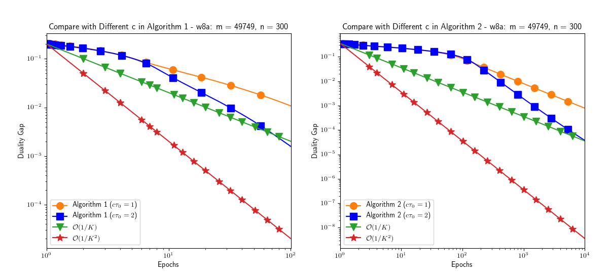
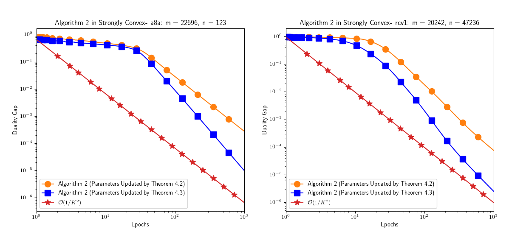

# AccSPD
An accelerated Stochastic Primal Dual Algorithm

## Introduction
This Algorithm can solve the following nonsmooth composite convex optimization problem:

 


where   are proper, closed and convex functions , is a convex and smooth function, and  is a given linear operator. We further assume that the prox-operator of  are easy to find.

## Prerequisites

The code is tested under Python 3.6 and it requires additional packages if you do not have them

* scipy: for working with datasets
* pickle: for saving and loading the data
* matplotlib: for plotting
* sklearn: for loading the LIBSVM data
* numpy: for scentific computing

These packages can be installed by
```
pip3 install scipy pickle matplotlib sklearn numpy
```
We support LIBSVM datasets which can be downloaded [here](https://www.csie.ntu.edu.tw/~cjlin/libsvmtools/datasets/binary.html). The downloaded dataset should be unzipped and put in the following folder

```
./data/
```

## Running the examples

we implemented two examples to test our algorithm.

### 1. Support Vector Machine (SVM) example

We have implemented two different versions of the solvers. The first version partitions the whole samples into some blocks. For example, use the following command to test the performance of our algorithms with `rcv1` dataset, `32` blocks and `1000` epochs:

```
python3 SVM_example.py -d rcv1 -blk 32 -ep 1000
```

The second version use a mini-batch at each iteration. For example, use the following command to test the performance of our algorithms with `w8a` datasets, `single` batch size and `3` epochs:

```
python3 SVM_example_single_sample.py -d w8a -bat 1 -ep 3
```

### 2. L1-regularized least absolute deviation (LAD) example

To test the LAD examle, use the commend below:
```
python3 LAD_example.py
```
You can go to the `LAD_example.py` script and define your own data.

## Testing the convergence rate

Use the commend below to test the convergence of our algorithms for non-strongly convex case with `w8a` datasets, `32` blocks and `1000` epochs:

```
python3 compare_c.py -d w8a -blk 32 -ep 1000
```

The following picture shows that our algorithm can do better than  in the general convex case:



Use the commend below to test the convergence of our algorithms for strongly convex case with `a8a` datasets, `32` blocks and `1000` epochs:

```
python3 compare_c_str_cvx.py -d a8a -blk 32 -ep 1000
```

The following picture shows that our algorithm can do better than  in the strongly convex case:


